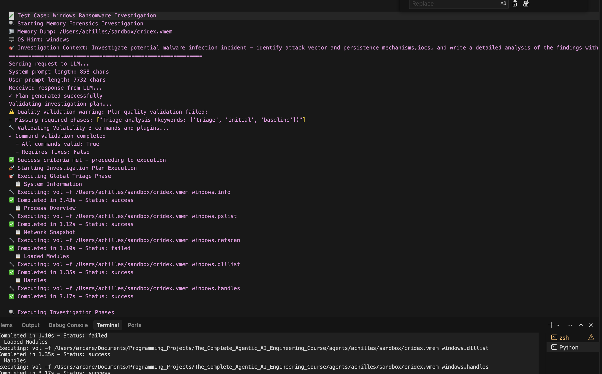
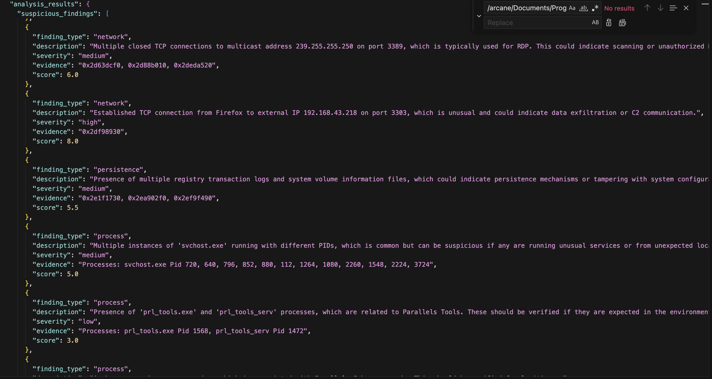

# Achilles

[](https://www.python.org/downloads/)
[](https://opensource.org/licenses/MIT)

**Achilles** is an advanced, production-ready memory forensics agent powered by AI. It automates memory forensics investigations using Volatility 3, combining intelligent planning, robust execution, and AI-powered threat analysis with chunked processing capabilities to handle large-scale forensics evidence.

**Repository**: [github.com/ProfArcanex01/achilles](https://github.com/ProfArcanex01/achilles)

## Screenshots

### Investigation Workflow


*The complete investigation workflow from planning to reporting*

### Sample Analysis Report


*Example of comprehensive threat intelligence output with threat scoring and recommendations*

## Key Features

### 🧠 **AI-Powered Investigation Planning**
- LLM-generated comprehensive investigation plans
- OS-specific analysis techniques
- Adaptive planning based on user context
- Volatility 3 command validation

### 🔧 **Robust Execution Engine**
- Professional Volatility command execution
- Suspicion heuristics application
- Evidence organization and chain of custody
- Comprehensive execution logging

### 🔍 **Advanced Chunked Analysis**
- **Token-aware processing** for large evidence files
- **Resumable analysis** with chunk persistence
- **Intelligent context splitting** preserving logical boundaries
- **Async parallel chunk processing** with 30-50% faster analysis
- **Rate-limit safe concurrency** with semaphore control and jittered delays
- **Graceful error handling** for individual chunk failures

### 📊 **Professional Reporting**
- Structured threat intelligence output (JSON format)
- Executive summaries for management
- Actionable recommendations
- Confidence scoring and threat assessment
- Comprehensive investigation reports saved to `analysis_results/` directory
- Execution summaries with command statistics
- Detailed analysis metadata for audit trails

## Architecture

### Workflow Pipeline
```
START → detect_os → planner → validate_plan → evaluator → execution → triage → [deeper_analysis] → reporting → END
```

**Note**: 
- The workflow starts with **OS detection** to identify the memory dump's operating system for optimal analysis
- The `deeper_analysis` step is conditionally triggered when the threat score exceeds the threshold (default: 7.0/10)
- Reporting generates comprehensive JSON reports and summaries for all analysis results

### Core Components

1. **OS Detection Node**: Automatically identifies memory dump operating system
2. **Planner Node**: Generates OS-specific investigation plans using LLM
3. **Validator Node**: Schema and quality validation with flexible phase detection
4. **Evaluator Node**: Volatility command verification with full plan visibility
5. **Execution Node**: Professional evidence collection with command deduplication
6. **Triage Node**: AI-powered threat analysis with async parallel chunking
7. **Deeper Analysis Node**: Advanced targeted investigation for high-threat findings
8. **Reporting Node**: Generates comprehensive JSON reports, summaries, and investigation documentation

## Async Parallel Chunked Analysis System

### Problem Solved
Large memory dumps can generate evidence that exceeds LLM token limits (128k tokens). The async parallel chunked analysis system automatically handles this by:

1. **Token Detection**: Uses tiktoken to accurately count tokens
2. **Intelligent Splitting**: Preserves logical boundaries in context
3. **Async Parallel Processing**: Analyzes multiple chunks concurrently (30-50% faster!)
4. **Rate Limit Safety**: Semaphore-based concurrency control with jittered delays
5. **Result Combination**: Merges findings using maximum threat score (worst-case wins)
6. **Resumability**: Saves progress for interrupted analyses
7. **Graceful Degradation**: Individual chunk failures don't stop entire analysis

### Performance Benefits

**Sequential (Old):**
- 10 chunks @ 20s each = 220 seconds (3m 40s)

**Parallel with Concurrency=2 (New):**
- 10 chunks @ 20s each = 120 seconds (2m 0s) ⚡ **45% FASTER!**

**Parallel with Concurrency=3:**
- 10 chunks @ 20s each = 85 seconds (1m 25s) ⚡ **61% FASTER!**

### Chunk Persistence Architecture

```
forensics_evidence/
└── Challenge_YYYYMMDD_HHMMSS/
    ├── analysis_chunks/
    │   ├── chunk_001.txt          # Raw chunk content
    │   ├── chunk_002.txt          
    │   ├── chunk_003.txt          
    │   ├── chunks_metadata.json   # Chunk information
    │   ├── analysis_metadata.json # Combined results metadata
    │   └── results/
    │       ├── chunk_001_result.json  # Individual chunk analysis
    │       ├── chunk_002_result.json  
    │       └── chunk_003_result.json  
    ├── analysis_report.json       # Final combined report
    └── [other evidence directories]
```

## Installation

### Prerequisites

- Python 3.12 or higher
- Volatility 3 installed and configured
- OpenAI API key (set as environment variable `OPENAI_API_KEY`)

### Setup

1. **Clone the repository:**
```bash
git clone git@github.com:ProfArcanex01/achilles.git
cd achilles
```

2. **Install dependencies:**
```bash
# Using uv (recommended)
uv sync

# Or using pip
pip install -e .
```

3. **Set up environment variables:**
```bash
# Create a .env file
echo "OPENAI_API_KEY=your_api_key_here" > .env
```

## Usage

### Basic Investigation

#### Option 1: Using the convenience function (Recommended)

```python
import asyncio
from forensics_agent import run_investigation

async def investigate_memory_dump():
    result = await run_investigation(
        memory_dump_path="/path/to/memory.raw",
        os_hint="windows",
        user_prompt="Ransomware incident - identify attack vector"
    )
    return result

# Run investigation
result = asyncio.run(investigate_memory_dump())
```

#### Option 2: Using the agent class directly

```python
import asyncio
from forensics_agent import MemoryForensicsAgent

async def investigate_memory_dump():
    agent = MemoryForensicsAgent()
    await agent.setup_llm()
    
    result = await agent.investigate(
        memory_dump_path="/path/to/memory.raw",
        os_hint="windows",
        user_prompt="Ransomware incident - identify attack vector"
    )
    return result

# Run investigation
result = asyncio.run(investigate_memory_dump())
```

#### Option 3: Using the command-line entry point

```bash
python run_forensics.py
```

Or modify `forensics_agent.py`'s `main()` function with your test cases.

### Resumable Chunked Analysis

If an analysis is interrupted, simply re-run with the same parameters:

```python
# First run - processes chunks 1-5, then fails
result1 = await run_investigation(
    memory_dump_path="/path/to/memory.raw",
    os_hint="windows",
    user_prompt="Investigate malware"
)

# Resume run - automatically detects existing chunks 1-5, continues from chunk 6
result2 = await run_investigation(
    memory_dump_path="/path/to/memory.raw",
    os_hint="windows",
    user_prompt="Investigate malware"
)
```

The system will automatically:
- Detect existing chunk files and results
- Skip already-completed chunks
- Continue from the last incomplete chunk
- Combine all results (existing + new) into final report

## Configuration

### Environment Variables

Achilles uses environment variables for configuration. Create a `.env` file or export these variables:

```bash
# Required
OPENAI_API_KEY=your_openai_api_key

# Async Parallel Chunking (New!)
FORENSICS_CHUNK_CONCURRENCY=2              # Max concurrent chunk analyses (default: 2)
                                            # Tier 1-2: 2, Tier 3-4: 3, Tier 5: 4-8

# Optional - Configuration overrides
FORENSICS_MAX_CHUNK_TOKENS=20000           # Max tokens per chunk
FORENSICS_MAX_RETRIES=5                    # Retry attempts on rate limit
FORENSICS_RATE_LIMIT_DELAY=1.0             # Base delay for rate limiting
FORENSICS_MAX_RATE_LIMIT_DELAY=60.0        # Maximum delay on rate limit
FORENSICS_LLM_TIMEOUT=120                  # LLM request timeout
FORENSICS_LLM_TEMPERATURE=0.0              # LLM temperature (0 = deterministic)
FORENSICS_LLM_MAX_TOKENS=4000              # Max tokens in LLM response
FORENSICS_PLANNER_MODEL=gpt-4o             # Model for planning
FORENSICS_EVALUATOR_MODEL=gpt-4o-mini      # Model for evaluation
FORENSICS_ANALYZER_MODEL=gpt-4o            # Model for analysis
FORENSICS_FALLBACK_ANALYZER_MODEL=gpt-4o-mini  # Fallback on rate limit
FORENSICS_SHELL_PATH=/bin/zsh              # Shell for volatility commands (default: /bin/sh)
FORENSICS_VOLATILITY_TIMEOUT=600           # Timeout for volatility commands in seconds
FORENSICS_THREAT_THRESHOLD=7.0             # Threshold for deeper analysis
FORENSICS_CONFIDENCE_THRESHOLD=0.8         # Minimum confidence threshold
FORENSICS_EVIDENCE_DIR=./forensics_evidence # Evidence storage directory
```

### Recommended Concurrency by OpenAI Tier

| Your Tier | RPM Limit | Recommended Setting | Expected Speedup |
|-----------|-----------|---------------------|------------------|
| **Tier 1-2** | 500-3.5k | `FORENSICS_CHUNK_CONCURRENCY=2` | 30-40% |
| **Tier 3-4** | 5k-10k | `FORENSICS_CHUNK_CONCURRENCY=3` | 40-50% |
| **Tier 5** | 30k+ | `FORENSICS_CHUNK_CONCURRENCY=4` | 50-60% |

**Find your tier:** https://platform.openai.com/settings/organization/limits

💡 **Tip:** Start with the default (2) and increase if you don't see rate limit errors.

### Programmatic Configuration

You can also configure Achilles programmatically:

```python
from forensics_agent import MemoryForensicsAgent
from config import ForensicsConfig

# Create custom configuration
config = ForensicsConfig(
    chunk_concurrency=3,      # Increase for faster analysis (if higher tier)
    max_chunk_tokens=20000,
    planner_model="gpt-4o",
    analyzer_model="gpt-4o",
    shell_path="/bin/zsh",    # Use zsh instead of default /bin/sh
    volatility_timeout=600,
    threat_score_threshold=7.0
)

# Use custom config with Achilles
agent = MemoryForensicsAgent(config)
await agent.setup_llm()
```

### Default Configuration

- **Chunk Concurrency**: 2 (safe for most OpenAI tiers)
- **Max Chunk Tokens**: 20,000 (conservative limit per chunk)
- **Planner Model**: gpt-4o
- **Evaluator Model**: gpt-4o-mini
- **Analyzer Model**: gpt-4o
- **Threat Score Threshold**: 7.0 (triggers deeper analysis)
- **Confidence Threshold**: 0.8

### Async Parallel Processing Strategy

The system uses intelligent parallel processing:
- **Semaphore Control**: Limits concurrent API calls to prevent rate limits
- **Jittered Delays**: Random 0.5-1.5s delays prevent burst patterns
- **Exponential Backoff**: Smart retry logic with jittered delays on rate limit errors
- **Graceful Error Handling**: Individual chunk failures don't stop entire analysis
- **Resumability**: Works seamlessly with chunk persistence for interrupted analyses

### Chunk Splitting Strategy
The system uses intelligent splitting:
- Preserves line boundaries
- Maintains logical sections (headers, data blocks)
- Balances chunk sizes for optimal processing

## Reporting

Achilles generates comprehensive reports at multiple stages of the investigation:

### Report Types

1. **Execution Summary** (`logs/execution_summary_*.json`)
   - Command execution statistics
   - Success/failure rates
   - Execution timing
   - Evidence directory locations

2. **Triage Analysis Report** (`analysis_results/chunked_analysis_metadata_*.json`)
   - Threat score and confidence
   - Suspicious findings
   - Key indicators
   - Recommended actions
   - Executive summary

3. **Deeper Analysis Report** (`deeper_analysis/analysis_results/deeper_analysis_*.json`)
   - Enhanced threat analysis
   - Correlated findings
   - Detailed investigation results
   - Advanced threat indicators

4. **Investigation Summary** (Console output)
   - Validation status
   - Execution statistics
   - Evidence directory paths
   - Overall investigation status

### Report Locations

All reports are saved in the evidence directory structure:
```
forensics_evidence/
└── Challenge_YYYYMMDD_HHMMSS/
    ├── logs/
    │   └── execution_summary_*.json
    ├── analysis_results/
    │   ├── chunked_analysis_metadata_*.json
    │   └── deeper_analysis_*.json
    └── deeper_analysis/
        └── analysis_results/
            └── deeper_analysis_*.json
```

## Output Structure

### Analysis Report Format

Real-world example from an actual investigation:

```json
{
  "timestamp": "2025-11-02T06:21:55.830229",
  "analysis_type": "deeper_analysis",
  "memory_dump_path": "/sandbox/memdump.mem",
  "os_hint": "windows",
  "user_prompt": "Investigate potential malware infection incident",
  "analysis_results": {
    "suspicious_findings": [
      {
        "finding_type": "process",
        "description": "lsass.exe accessing PASSWD.LOG in Windows debug directory, indicating potential credential dumping.",
        "severity": "high",
        "evidence": "lsass.exe accessing \\Device\\HarddiskVolume1\\Windows\\debug\\PASSWD.LOG",
        "score": 8.5
      },
      {
        "finding_type": "network",
        "description": "Established TCP connection from Firefox to external IP, indicating potential data exfiltration or C2 communication.",
        "severity": "high",
        "evidence": "TCP connection from Firefox to 192.168.43.218:3303",
        "score": 8.0
      },
      {
        "finding_type": "process",
        "description": "Multiple cmd.exe processes spawned by firefox.exe, indicating potential command execution or script running.",
        "severity": "high",
        "evidence": "Process tree shows cmd.exe (PIDs 4088, 4980) spawned by firefox.exe (PID 2792)",
        "score": 8.0
      },
      {
        "finding_type": "persistence",
        "description": "WFS.exe in System32 with corrupted path characters, indicating potential masquerading or tampering.",
        "severity": "high",
        "evidence": "Path: \\Windows\\System32\\WFS.exe with corrupted Unicode characters",
        "score": 8.0
      }
    ],
    "executive_summary": "Combined analysis of 30 chunks identified 104 findings across processes, network, persistence, and memory categories. High-severity threats include credential dumping attempts, suspicious network connections, and process manipulation.",
    "threat_score": 6.78,
    "analysis_confidence": 0.845,
    "key_indicators": [
      "lsass.exe accessing PASSWD.LOG",
      "Established TCP connection to external IP from Firefox",
      "Multiple cmd.exe processes spawned by firefox.exe",
      "WFS.exe with corrupted path",
      "Persistence mechanisms in svchost.exe",
      "Potential process injection or manipulation",
      "Unusual registry and file access by explorer.exe",
      "Multiple svchost.exe instances with unusual DLLs"
    ],
    "recommended_actions": [
      "Isolate the affected system from the network to prevent potential lateral movement",
      "Investigate the lsass.exe process for credential dumping activity",
      "Review network activity associated with Firefox for data exfiltration",
      "Examine command line history and actions performed by cmd.exe processes",
      "Conduct detailed analysis of svchost.exe processes to identify injected code",
      "Review system logs and network traffic for signs of lateral movement",
      "Perform full malware scan using updated antivirus definitions",
      "Monitor network traffic for unusual patterns or C2 communications"
    ]
  },
  "investigation_stage": "analysis_completed"
}
```

### Chunk Metadata
```json
{
  "analysis_type": "chunked_analysis",
  "timestamp": "2025-09-22T22:07:47.123456",
  "chunk_summary": {
    "total_chunks": 5,
    "chunks_directory": "./analysis_chunks",
    "successful_chunks": 5
  },
  "combined_results_summary": {
    "overall_threat_score": 7.0,
    "total_findings": 12,
    "unique_indicators": 8,
    "analysis_confidence": 0.85
  }
}
```

## State Management

### ForensicState Variables
```python
class ForensicState(TypedDict):
    # Core investigation
    memory_dump_path: Optional[str]
    investigation_plan: Optional[str]
    os_hint: Optional[str]
    user_prompt: Optional[str]
    
    # Validation & execution
    validation_status: Optional[str]
    execution_status: Optional[str]
    execution_results: Optional[Dict[str, Any]]
    evidence_directory: Optional[str]
    
    # Analysis results
    analysis_results: Optional[Dict[str, Any]]
    threat_score: Optional[float]
    analysis_confidence: Optional[float]
    key_indicators: Optional[List[str]]
    recommended_actions: Optional[List[str]]
    
    # Workflow control
    retry_count: Optional[int]
    success_criteria_met: Optional[bool]
    investigation_stage: Optional[str]
```

## Advanced Features

### Resumability Benefits

1. **Cost Optimization**: Avoid re-analyzing expensive chunks
2. **Time Efficiency**: Resume from interruption point
3. **Debugging**: Inspect individual chunk content and results
4. **Audit Trail**: Complete record of analysis progression

### Intelligent Chunk Combination

The system intelligently merges chunk results:

```python
# Threat scoring: Takes maximum score across chunks
overall_threat_score = max(threat_scores)

# Confidence: Averages confidence across chunks  
overall_confidence = sum(confidence_scores) / len(confidence_scores)

# Findings: Combines and deduplicates across chunks
unique_indicators = list(set(all_indicators))
```

### Progress Tracking

**Async Parallel Processing Output:**
```
📊 Performing parallel chunked analysis:
   - Total context: 201,605 tokens
   - Number of chunks: 8
   - Max chunk size: 20,000 tokens
   - Concurrency limit: 2  ← Processing 2 chunks at once!
   - Chunks saved to: ./forensics_evidence/Challenge_20250922_220747/analysis_chunks

♻️  Chunk 1/8 already analyzed - loading existing results...
♻️  Chunk 2/8 already analyzed - loading existing results...

🔍 Analyzing chunk 3/8 (19,800 tokens) [delay: 1.2s]...
🔍 Analyzing chunk 4/8 (20,000 tokens) [delay: 0.8s]...  ← Running in parallel!
   ✅ Chunk 3 completed - Threat Score: 6.5
   ✅ Chunk 4 completed - Threat Score: 7.2

🔍 Analyzing chunk 5/8 (19,500 tokens) [delay: 1.4s]...
🔍 Analyzing chunk 6/8 (18,900 tokens) [delay: 0.9s]...  ← Running in parallel!
   ✅ Chunk 5 completed - Threat Score: 5.8
   ✅ Chunk 6 completed - Threat Score: 6.1

🔗 Combining analysis results from all chunks...
   📊 Threat Score Range: 5.8 - 7.2 (using MAX from chunk 4)
✅ Combined Analysis Complete!
```

**Performance Impact:**
- Sequential (old): ~160 seconds
- Parallel (new): ~85 seconds ⚡ **47% faster!**

## Error Handling

### Async Parallel Resilience
- **Individual chunk failures** don't stop entire analysis
- **Graceful error handling** with `asyncio.gather(..., return_exceptions=True)`
- **Failed chunks logged** and skipped, successful chunks continue
- **Partial results** still provide valuable intelligence

### Rate Limit Protection
- **Semaphore control** limits concurrent API calls
- **Jittered delays** (0.5-1.5s random) prevent burst patterns
- **Exponential backoff** with jitter on rate limit errors
- **Automatic retry logic** with configurable max retries
- **Smart wait times** extracted from API error messages

### Network Interruption Recovery
- All chunk content saved to disk before analysis
- Individual results saved immediately after completion
- Resume capability works seamlessly with parallel processing
- Existing chunk results loaded first, only missing chunks analyzed

### Token Limit Management
- Automatic detection of oversized contexts
- Conservative chunking to prevent API errors
- Graceful fallback for edge cases

## Best Practices

### Investigation Planning
1. **Provide context**: Use descriptive `user_prompt` for better planning
2. **Specify OS**: Include `os_hint` for targeted analysis
3. **Review plans**: Check generated plans before execution

### Performance Optimization
1. **Monitor token usage**: Large evidence files benefit from chunking
2. **Tune concurrency**: Increase `FORENSICS_CHUNK_CONCURRENCY` for higher OpenAI tiers
3. **Resume capability**: Use for long-running investigations
4. **Resource management**: Ensure adequate disk space for chunk storage
5. **Start conservative**: Use concurrency=2 (default) and increase if no rate limits

### Security Considerations
1. **Evidence integrity**: Maintain chain of custody documentation
2. **Data protection**: Secure evidence directories appropriately
3. **Access control**: Limit access to sensitive forensics data

## Troubleshooting

### Common Issues

**Token Limit Errors**
- Solution: Chunked analysis automatically handles this

**Rate Limit Errors (429)**
- **Symptom**: `⏳ Rate limit hit, waiting X.Xs before retry`
- **Solution 1**: Reduce concurrency: `export FORENSICS_CHUNK_CONCURRENCY=1`
- **Solution 2**: Use smaller model: `export FORENSICS_ANALYZER_MODEL=gpt-4o-mini`
- **Solution 3**: Wait for rate limit window to reset

**Slower Than Expected Performance**
- **Check concurrency**: `FORENSICS_CHUNK_CONCURRENCY` should be 2 or higher
- **Verify chunking**: Look for "Performing parallel chunked analysis" in output
- **Context size**: Small contexts (<20k tokens) use single analysis (no speedup)

**Interrupted Analysis** 
- Solution: Re-run with same parameters to resume
- Existing chunks automatically loaded, only missing chunks analyzed

**All Chunks Failing**
- **Check LangChain version**: `pip install --upgrade langchain-openai>=0.2.0`
- **Verify API key**: `echo $OPENAI_API_KEY`
- **Test with concurrency=1**: Isolate if it's a parallel processing issue

**Missing Dependencies**
- Ensure `volatility_executor.py` is available
- Install required packages: `uv sync` or `pip install -e .`
- Verify Volatility 3 is installed and accessible

**Chunk Loading Failures**
- Check filesystem permissions
- Verify evidence directory structure
- Ensure `.env` file exists with `OPENAI_API_KEY` set

**Authentication Errors**
- Verify `OPENAI_API_KEY` is set in environment or `.env` file
- Check API key has sufficient credits/quota

### Debug Information

Enable verbose logging to troubleshoot:
```python
# The system automatically provides detailed progress logs
# Check console output for chunk processing status
# Examine individual chunk files for content verification
```

## Dependencies

The project uses `uv` for dependency management. Key dependencies include:

- **langchain-openai** - OpenAI integration for LLM operations
- **langgraph** - Workflow graph orchestration
- **python-dotenv** - Environment variable management
- **pydantic** - Data validation and schemas
- **tiktoken** - Token counting for chunking (used via langchain)

### Installing Dependencies

```bash
# Using uv (recommended - faster and more reliable)
uv sync

# Or using pip
pip install -e .

# Or install specific dependencies
pip install langchain-openai langgraph python-dotenv pydantic
```

See `pyproject.toml` for the complete dependency list.

## Recent Enhancements (December 2024)

### ✅ Implemented

1. **Async Parallel Chunk Processing** - 30-50% faster analysis with concurrent chunk processing
2. **OS Detection Node** - Automatic OS identification before planning
3. **Command Deduplication** - Eliminates redundant command execution across phases
4. **Improved Evaluator** - Full plan visibility instead of truncated 2000 chars
5. **Flexible Phase Validation** - Requires 3 of 5 core phases instead of all 5
6. **Safer Command Execution** - Removed `shell=True`, using `shlex.split()` with validation
7. **Maximum Threat Score** - Changed from averaging to maximum (worst-case wins)

### 🚀 Future Enhancements

1. **Dynamic Concurrency Adjustment** - Automatically adjust based on rate limit responses
2. **Smart Chunk Prioritization** - Analyze high-priority chunks first
3. **Streaming Results** - Yield results as chunks complete (don't wait for all)
4. **Rate Limit Header Monitoring** - Parse OpenAI headers to optimize concurrency
5. **Incremental Updates** - Update analysis as new evidence arrives
6. **Cross-Investigation Correlation** - Link findings across cases

## Project Structure

```
achilles/
├── config/                        # Configuration management
│   └── settings.py                # ForensicsConfig class
├── models/                        # Data models and schemas
│   ├── schemas.py                 # Pydantic models
│   └── state.py                   # ForensicState TypedDict
├── nodes/                         # Workflow nodes
│   ├── os_detection.py            # OS detection (NEW!)
│   ├── planner.py                 # Investigation planning
│   ├── evaluator.py               # Command evaluation
│   └── execution.py               # Evidence collection
├── engines/                       # Analysis engines
│   └── deeper_analysis.py         # Advanced analysis
├── utils/                         # Utility functions
│   ├── tokens.py                  # Token counting
│   ├── validation.py              # Schema validation
│   └── messages.py                # Message formatting
├── forensics_agent.py             # Main agent class (async parallel chunks!)
├── forensics_tools.py             # Volatility tool definitions
├── volatility_executor.py         # Volatility command execution (deduplication!)
├── run_forensics.py               # CLI entry point
├── test_async_implementation.py   # Async verification tests (NEW!)
├── pyproject.toml                 # Dependencies
├── README.md                      # This file
├── ASYNC_PARALLEL_CHUNKS.md       # Async implementation docs (NEW!)
├── ASYNC_CHUNKS_QUICKSTART.md     # Quick start guide (NEW!)
└── ASYNC_IMPLEMENTATION_SUMMARY.md # Implementation summary (NEW!)
```

## Documentation

### Core Documentation
- **README.md** (this file) - Complete overview and usage guide
- **TECHNICAL_GUIDE.md** - Technical implementation details
- **WORKFLOW_GRAPH_DIAGRAM.md** - Workflow visualization

### Async Parallel Processing Docs (NEW!)
- **ASYNC_CHUNKS_QUICKSTART.md** - Quick start guide for async parallel chunks
- **ASYNC_PARALLEL_CHUNKS.md** - Comprehensive technical documentation
- **ASYNC_IMPLEMENTATION_SUMMARY.md** - Implementation details and changes

## Support

For issues or questions about Achilles:

1. **Check logs**: Review execution logs in `forensics_evidence/*/logs/`
2. **Debug chunks**: Inspect chunk files in `forensics_evidence/*/analysis_chunks/`
3. **Verify setup**: Ensure Volatility 3 and dependencies are installed
4. **Review configuration**: Check `.env` file and environment variables
5. **Async issues**: See `ASYNC_CHUNKS_QUICKSTART.md` for troubleshooting

## Contributing

Contributions are welcome! Please ensure:
- Code follows existing patterns
- Tests pass (if applicable)
- Documentation is updated
- No sensitive data is committed (see `.gitignore`)


**Last Updated**: December 2024

This documentation covers the complete Achilles system with emphasis on the **async parallel chunked analysis** capabilities that enable **30-50% faster** processing of large-scale forensics evidence while maintaining rate-limit safety, resumability, and comprehensive threat intelligence reporting.

---

## Quick Links

- 🚀 **[Async Quick Start](ASYNC_CHUNKS_QUICKSTART.md)** - Get started with parallel processing
- 📚 **[Technical Guide](TECHNICAL_GUIDE.md)** - Deep dive into implementation
- 🔧 **[Configuration Reference](config/settings.py)** - All configuration options
- 🐛 **[Troubleshooting](ASYNC_CHUNKS_QUICKSTART.md#troubleshooting)** - Common issues and solutions

---

*Built with ❤️ for the memory forensics community*

