# AI-Powered Memory Forensics Workflow Graph

## Visual Representation of the Investigation Workflow

The following diagram represents the complete workflow graph implemented in the AI-powered memory forensics system, showing all nodes, edges, and conditional routing logic.

```mermaid
graph TD
    START([START]) --> planner[🧠 Planning Node<br/>GPT-4o Planner LLM<br/>Generate Investigation Plan]
    
    planner --> validate_plan[✅ Validation Node<br/>JSON Schema Validation<br/>Quality Assessment]
    
    validate_plan --> evaluator[🔍 Evaluation Node<br/>GPT-4o-mini Evaluator LLM<br/>Command Validity Check]
    
    evaluator -->|Success Criteria Met| execution[⚡ Execution Node<br/>Volatility 3 Commands<br/>Evidence Collection]
    evaluator -->|Retry Needed<br/>retry_count < max_retries| planner
    evaluator -->|Max Retries Reached<br/>or User Input Needed| END1([END])
    
    execution -->|Execution Completed<br/>or Partial Success| triage[🔬 Triage Analysis Node<br/>GPT-4o Analyzer LLM<br/>Chunked Analysis]
    execution -->|Execution Failed| END2([END])
    
    triage -->|Threat Score ≥ 7.0<br/>or Critical Patterns| deeper_analysis[🎯 Deeper Analysis Node<br/>Targeted Investigation<br/>Enhanced Correlation]
    triage -->|Low Threat Score<br/>or Analysis Complete| END3([END])
    
    deeper_analysis --> END4([END])
    
    %% Styling
    classDef startEnd fill:#e1f5fe,stroke:#01579b,stroke-width:3px,color:#000
    classDef planning fill:#f3e5f5,stroke:#4a148c,stroke-width:2px,color:#000
    classDef execution fill:#e8f5e8,stroke:#1b5e20,stroke-width:2px,color:#000
    classDef analysis fill:#fff3e0,stroke:#e65100,stroke-width:2px,color:#000
    classDef decision fill:#ffebee,stroke:#b71c1c,stroke-width:2px,color:#000
    
    class START,END1,END2,END3,END4 startEnd
    class planner,validate_plan,evaluator planning
    class execution execution
    class triage,deeper_analysis analysis
```



## Detailed Node Descriptions

### 🧠 Planning Node
- **LLM**: GPT-4o (configurable)
- **Purpose**: Generate context-aware investigation plans
- **Input**: Memory dump path, OS hint, user prompt
- **Output**: Structured investigation plan with phases and commands
- **Temperature**: Higher (creative planning)

### ✅ Validation Node
- **Type**: Rule-based validation
- **Purpose**: Ensure plan structure and syntax compliance
- **Input**: Generated investigation plan
- **Output**: Validation status (passed/failed)
- **Validation**: JSON Schema + Quality checks

### 🔍 Evaluation Node
- **LLM**: GPT-4o-mini (configurable)
- **Purpose**: Assess Volatility command validity
- **Input**: Validated investigation plan
- **Output**: Success criteria assessment + feedback
- **Temperature**: Structured output for validation

### ⚡ Execution Node
- **Type**: Volatility 3 command execution
- **Purpose**: Execute validated investigation plan
- **Input**: Evaluated and validated plan
- **Output**: Execution results, evidence files, execution summary
- **Features**: Parallel execution, error handling, evidence preservation

### 🔬 Triage Analysis Node
- **LLM**: GPT-4o (configurable)
- **Purpose**: AI-powered analysis of execution results
- **Input**: Execution results and evidence files
- **Output**: Threat score, suspicious findings, key indicators
- **Features**: Chunked analysis, resumable processing
- **Temperature**: Low (0.1) for consistent analysis

### 🎯 Deeper Analysis Node
- **Type**: Specialized analysis engine
- **Purpose**: Targeted investigation based on triage findings
- **Input**: Triage results with high threat indicators
- **Output**: Enhanced threat intelligence, detailed findings
- **Features**: Correlation analysis, enhanced reporting

## Conditional Routing Logic

### From Evaluator Node:
1. **Success Criteria Met** → Continue to Execution
2. **Retry Needed** (retry_count < max_retries) → Return to Planner
3. **Max Retries Reached** or **User Input Needed** → END

### From Execution Node:
1. **Execution Completed** or **Partial Success** → Continue to Triage
2. **Execution Failed** → END

### From Triage Node:
1. **Threat Score ≥ 7.0** or **Critical Patterns Detected** → Deeper Analysis
2. **Low Threat Score** or **Analysis Complete** → END

## State Management

The workflow maintains a comprehensive `ForensicState` with 25+ tracked variables:

```python
class ForensicState(TypedDict):
    # Core investigation parameters
    memory_dump_path: Optional[str]
    os_hint: Optional[str]
    user_prompt: Optional[str]
    
    # Planning outputs
    investigation_plan: Optional[str]
    investigation_stage: Optional[str]
    validation_status: Optional[str]
    validation_error: Optional[str]
    
    # Evaluation results
    evaluation_feedback: Optional[str]
    success_criteria_met: Optional[bool]
    user_input_needed: Optional[bool]
    retry_count: Optional[int]
    
    # Execution results
    execution_status: Optional[str]
    execution_results: Optional[Dict[str, Any]]
    execution_error: Optional[str]
    evidence_directory: Optional[str]
    execution_summary: Optional[Dict[str, Any]]
    
    # Analysis findings
    analysis_results: Optional[Dict[str, Any]]
    analysis_confidence: Optional[float]
    threat_score: Optional[float]
    key_indicators: Optional[List[str]]
    recommended_actions: Optional[List[str]]
    
    # Workflow control
    messages: Annotated[List[Any], add_messages]
```

## Workflow Characteristics

### Sequential Flow:
```
START → planner → validate_plan → evaluator → execution → triage → deeper_analysis → END
```

### Parallel Capabilities:
- **Command Execution**: Parallel Volatility command execution where feasible
- **Chunked Analysis**: Independent chunk processing with result combination
- **Multi-LLM Processing**: Specialized LLMs for different tasks

### Error Handling:
- **Graceful Degradation**: System continues despite individual command failures
- **Retry Logic**: Automatic retry with exponential backoff
- **Fallback Mechanisms**: Alternative approaches when primary methods fail
- **Resumability**: Chunked analysis can resume from interruption points

### Performance Optimizations:
- **Token Management**: Intelligent chunking for large evidence sets
- **LLM Specialization**: Different models optimized for different tasks
- **Caching**: Result persistence for resumable analysis
- **Resource Management**: Efficient memory and CPU utilization

## Integration Points

### LangGraph Framework:
- **State Management**: Deterministic state transitions
- **Conditional Routing**: Dynamic workflow paths based on results
- **Error Recovery**: Built-in error handling and retry mechanisms
- **Scalability**: Support for complex, multi-step workflows

### Volatility 3 Integration:
- **Command Execution**: Direct integration with Volatility 3 framework
- **Plugin Support**: Comprehensive plugin ecosystem access
- **Output Processing**: Structured parsing of Volatility outputs
- **Evidence Preservation**: Chain of custody maintenance

### LLM Integration:
- **Multi-Model Architecture**: Specialized LLMs for different tasks
- **Structured Output**: Pydantic models for consistent data structures
- **Temperature Optimization**: Task-specific temperature settings
- **Token Management**: Intelligent chunking and processing

